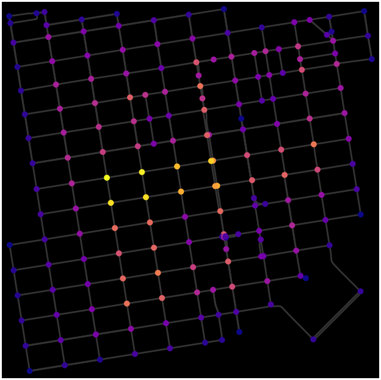
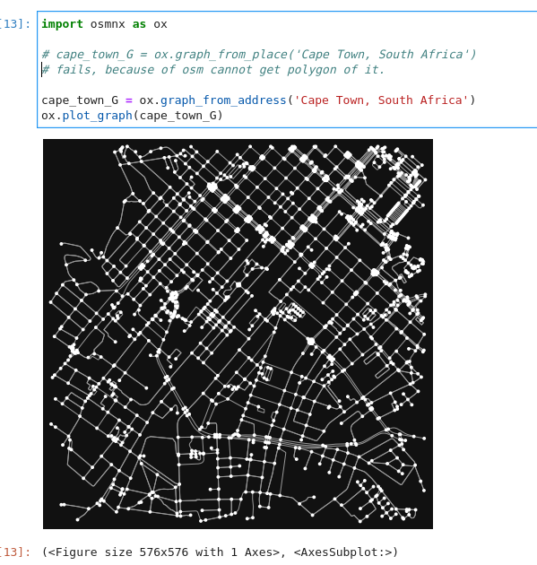
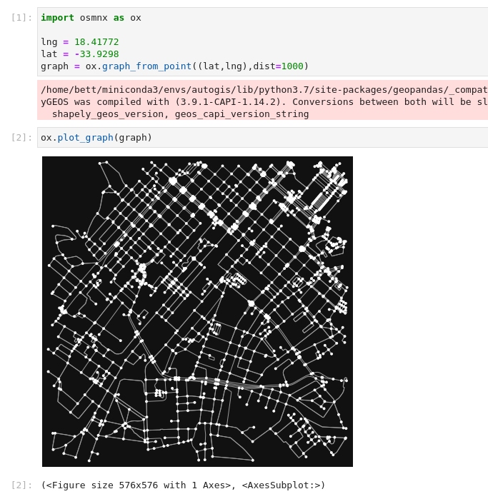
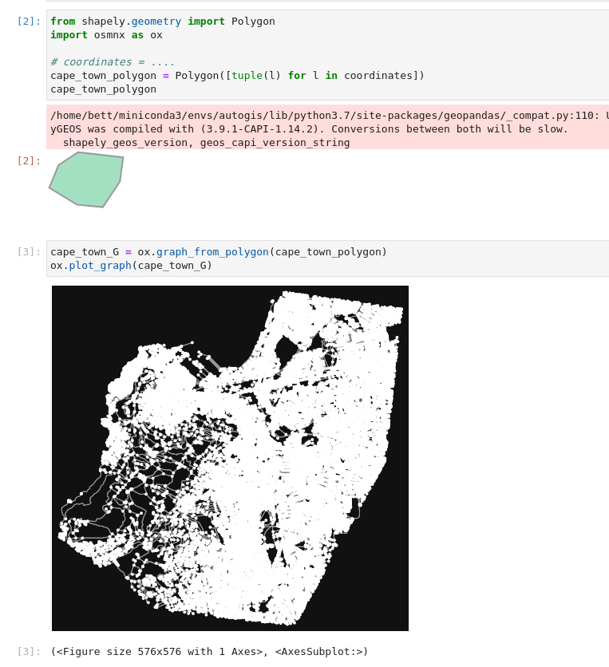

# Find the shortest routes using osmnx and use fastapi to deploy the routing service as an API

## About
This python project uses OpenStreetMap data, the python package osmnx to calculate the shortest route from getting from one coordinate to another coordinate. 

## Packages used
### [Osmnx](https://osmnx.readthedocs.io/)
OSMnx is a Python package that lets you download geospatial data from OpenStreetMap and model, project, visualize, and analyze real-world street networks and any other geospatial geometries.
#### Usage
    1. Download street networks from OpenStreetMap as a graph.
    2. Calculate the shortest paths.
    3. Create the shortest route(s) service.

### [Fastapi](https://fastapi.tiangolo.com/)
FastAPI is a modern, fast (high-performance), web framework for building APIs with Python 3.6+ based on standard Python type hints.
#### Usage
    1. Create the API service users can use to interact with shortest route service. 
    2. Create OpenAPI swagger interface.


## How it works
### Graphs
 - We use osmnx to download road graph networks from osmnx. The downloaded graph is a networkx graph which contains nodes and edges which make solving the problem of shortest path a breeze. 


### Downloading graphs from OpenStreetMap using osmnx

#### Graph from address
This is how to download a graph using a place name


#### Graph from coordinate plus distance
This is how to download a graph using a coordinate and distance parameter



#### Graph from shapely polygon
This is how to download a graph using a [shapely](https://shapely.readthedocs.io/en/stable/manual.html) polygon


### Getting the shortest routes.
Given an origin and destination coordinate(x,y) and a graph, to find the nearest route, we need to get the nearest graph node to the origin coordinate and the nearest graph node to the destination.<br>

We use osmnx to get the nearest node to a point (X,Y) as 
```python
import osmnx as ox
graph = ox.graph_from_point((center_lat,center_lng),dist=4000)
orig_node = ox.nearest_nodes(graph, Y=orig_lat, X=orig_lng)
dest_node = ox.nearest_nodes(graph, Y=dest_lat, X=dest_lng)
```

Once we have the have the origin and destination nodes, we can use osmnx to find the shortest path we can traverse to move from the origin to the destination node. <br>

The code to query the the shortest_path to traverse from the graph is just a single line of code.

```python
shortest_path = ox.shortest_path(graph, orig_node, dest_node)
```

Once we get the shortest path, it contains a List[int] which is a series of nodes indexed by osmid of the node. The graph has a getter ```nodes``` which is a NodeView. When we index the nodeview using a node, we get a dictionary which contains an x and y attribute
```python
import osmnx as ox
graph = ox.graph_from_point((center_lat,center_lng),dist=4000)
orig_node = ox.nearest_nodes(graph, Y=orig_lat, X=orig_lng)
node_value = graph.nodes[orig_node]
# returns {'y': -1.1091688, 'x': 36.6310601, 'street_count': 3}
lat = node_value['y']
lng = node_value['x']
```
<br>
So to get the list of coordinates, we use a helper function to iterate over the graph nodes returned as shortest_path and convert it into a list of LatLng

```python
def nodes_to_linestring(path, graph) -> List[LatLng]:
    coords_list = [
        LatLng(lon=graph.nodes[i]["x"], lat=graph.nodes[i]["y"]) for i in path
    ]
    return coords_list
```

## Creating fastapi endpoints
When the server starts up, we download the graph and save it to an attribute called capetown_G.
```python
import osmnx as ox
from shapely.geometry import box

# Download the graph. Change this to your Area of Interest
capetown_G = ox.graph_from_address(
    "Cape Town, South Africa", dist=5000, network_type="drive"
)

# split graph into nodes and edges to get the bounds of the graph.
nodes, edges = ox.graph_to_gdfs(capetown_G)

minx, miny, maxx, maxy = nodes.total_bounds

# create polygon/envelope we'll use to check whether the point the user requests from the graph falls within our graph
graph_bounds = box(minx, miny, maxx, maxy) 

```

### Shortest Route

```python
# Endpoint to get the shortest route. The parameters origin_lat,origin_lng,destination_lat,destination_lng will be passed in as query parameters when calling the API. We then call the 
import find_route_functions
from fastapi import FastAPI, Response

app = FastAPI()

@app.get("/shortest_route")
def read_shortest_route(
    origin_lat: float,
    origin_lng: float,
    destination_lat: float,
    destination_lng: float,
):
    if not (
        graph_bounds.contains(Point(origin_lng, origin_lat))
        and graph_bounds.contains(Point(destination_lng, destination_lat))
    ):
        return Response(
            status_code=400, content="Origin or destination outside of Cape Town"
        )

    shortest_path = find_route_functions.shortest_path(
        orig_lat=origin_lat,
        orig_lng=origin_lng,
        dest_lat=destination_lat,
        dest_lng=destination_lng,
        graph=capetown_G,
    )
    return linestring_to_feature(shortest_path)

```

### K Shortest Routes

